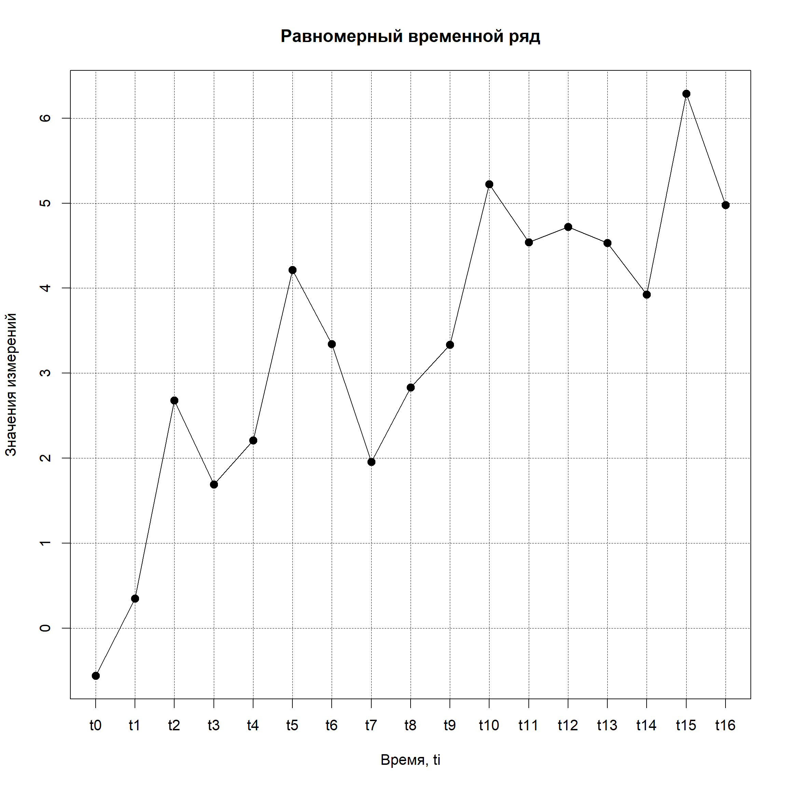

## Введение

Данная работа посвящена исследованию возможности построения алгоритма автоматического выявления паттернов медленного движения временного ряда (тренда) на основе линеаризуемых основных моделей динамики природных систем, реализующихся в виде дифференциальных уравнений. Среди таких моделей чаще всего употребимы в классических научных трудах: модели интенсивного роста на основе изменения темпов роста, модели ограниченного роста на основе лимитированной энергии развития системы, комплексные модели динамики систем.

Проблема изучения и выявления характеристик временного ряда данных является классической. В общей постановке, единообразного математического подхода исследования временных рядов с возможностью дальнейшего прогнозирования и верификации наблюдений нет и по сей день. Каждая динамическая система изучается в отдельности и к каждой динамической системе необходим уникальный подход. Однако, на текущий момент существует большое количество общих рекомендаций и решений, которые способствуют выработке правильных выводов о характере динамики и поведении системы как на уровне быстрых движений вокруг общей тенденции, так и на трендовом уровне. Системы таких рекомендаций и решений являются довольно мощными инструментами в вопросах исследования временных рядов и их свойств. Среди таких методов существуют следующие: алгоритм преобразования Фурье, STL-декомпозиция временного ряда, анализ распределений, структурная функция Колмогорова и функция Альтера-Джонсона, корреляционные и автокорреляционные функции.   
Проблематика данной работы была естественным образом поставлена в момент разработки алгоритма выявления почти-периодических компонент динамических систем на основе обобщенной сдвиговой функции Альтера-Джонсона и алгоритма выявления почти пропорций. 

Практическая значимость работы состоит в обогащении коллекции алгоритмов выявления значимых характеристик временного ряда данных новым алгоритмом, позволяющим на основе определенных метрик выявить наиболее закономерные участки медленных движений временного ряда данных, отвечающих природным динамическим моделям развития систем. 

## Теоретическая часть

### Временные ряды

Временной ряд - собранные в разные моменты времени значения показателей наблюдаемой системы или исследуемого процесса. Каждое измеренное значение системы называется измерением или отсчётом. Во временном ряде для каждого отсчёта должно быть указано время измерения и (или) номер измерения по порядку следования. 

Временной ряд является более сложным понятием в науке о данных по сравнению с понятием *статистической выборки*. Если в статистике статистическая выборка это набор независимых случайно выбранных наблюдений, характеризующих систему в целом, то в понятии *временной ряд* фигурируют такие понятия как зависимость наблюдений друг от друга, зависимость наблюдений от времени и следования. Все эти факторы необходимо учитывать при построении моделей или при анализе данных такого рода.

Временные ряды в простой классификации бывают *равномерные* и *неравномерные* и различаются характером снятия измерений с динамической системы.

### Равномерный временной ряд

Равномерный временной ряд - ряд данных, измерения или отсчёты в котором производятся через равные интервалы времени, т.е. записываются в таблицу с определенной заранее заданной частотой. Система математически записывается следующим образом:

$$
t_i = t_0 + i * \Delta t, \ \ \ t_0 = const, \ \ \ \Delta t = const, \ \ \ i = 0, \dots, N;
$$

$$
\varphi^j(t_i) = \varphi_i^j, \ \ \ j = 1, \dots, M,
$$
где $t_0$ - начальный момент времени или время зарождения процесса; $\Delta t$ - период времени, через который производятся измерения числовых показателей изучаемой системы; $N$ - текущий отсчет, соответствующий настоящему моменту времени или отсчет, соответствующий моменту времени завершения процесса в прошлом; $M$ - количество снимаемых динамических показателей из системы $\varphi$; $\varphi^j$ - динамический показатель системы, измеряемый во времени.

<!-- -->

Таким образом определяется равномерный временной ряд $\varphi^j$ наблюдаемой системы $\varphi$. 

Зачастую равномерные временные ряды это ряды с относительно небольшим возрастом, так как исторические данные в силу технического развития не могли быть сняты через одинаковые довольно короткие промежутки времени. В настоящий момент можно встретить временные ряды с частотой дискретизации наблюдений порядка десяток тысяч наблюдений в секунду.

### Модель интенсивного роста с темпами роста пропорциональными размеру системы

В процессе развития систем имеются такие этапы, на которых темпы воспроизводства не убывают, а растут, то есть для уравнения 

$$
\overset{\cdot}{y} = ky
$$
коэффициент $k$ растёт. Такие этапы, как правило, имеют небольшую длительность, в связи с чем часто выпадают из анализа.

Пусть например темп роста пропорционален размеру системы

$$
k = a \cdot y,
$$
где $y$ - размер системы

Тогда, 

$$
\overset{\cdot}{y} = ky^2,
$$

$$
y = -\frac{1}{a\cdot t + c}.
$$

Анаморфозой для данного вида модели является:

$$
\frac{1}{y} = a\cdot t + c.
$$

### Логистическая модель ограниченного роста

Простейшей широко распространенной моделью системы ограниченного роста является логистическое уравнение

$$
\frac{dy}{dt} = k \cdot y \cdot \left(1 - \frac{y}{y_{\infty}} \right),
$$
где ${y_{\infty}}$ - предел роста. Вдали от предела доминирует процесс типа расширенного воспроизводства, а при приближении к пределу процесс перетекает под влиянием прессинга исчерпания ресурса.

Из исходного уравенния логистической модели получается анаморфоза 

$$
\frac{dy}{ydt} = k \cdot \left(1 - \frac{y}{y_{\infty}} \right).
$$

### Анализ сезонности на основе функции Альтера-Джонсона

Для выявления периодов, свободных по возможности от априорных предположений, используем подход, который опирается, прежде всего, на фундаментальное характеристическое свойство периода функции, состоящее в повторении значений функции через интервал изменения независимой переменной равный периоду

$$
f(t + \tau) - f(t) = 0
$$

Вводится следующее определение почти–периодической функции: число $\tau$ называется $\varepsilon$ – почти–периодом ($\varepsilon$ – смещением) функции $f(t)$ $(-\infty < t < \infty)$, если для всех $t$ выполняется неравенство

$$
|f(t + \tau) - f(t)| < \varepsilon
$$

Если $f(t)$ – периодическая функция и $\tau$ – ее период, то есть $f(t+\tau) = f(t)$, то, очевидно, $\tau$ является также и почти–периодом для любого $\varepsilon>0$, точно так же, как и любое число вида $n \tau$ $(n= \pm 1, \pm 2, …)$.

Для дискретного случая, если $n$ - общее число отсчетов функции $f(t)$, заданной экспериментальными значениями, вводится следующая метрика для определения почти периодов:

$$
a(\tau) = \frac{1}{N} \sum_{t = 0}^{N - \tau - 1} ||f(t + \tau) - f(t)||_p 
$$

Эта функция называется сдвиговой или функцией Альтера-Джонса.

Система почти - периодов $τ$ функции $f(t)$ может быть определена как совокупность локальных минимумов сдвиговой функции

$$
\tau = argmin[a(\tau)], \ \ \ \tau_{min} < \tau < \tau_{max}
$$

Функция Альтера–Джонса определяет среднее расстояние по оси ординат между точками, расположенными на расстоянии $τ$ по оси абсцисс друг от друга.

### Обобщенная сдвиговая функция

$$
a(\tau, \Delta t) = \frac{1}{N} \sum_{t = 0}^{N - \tau - 1} ||R(t + \tau, \Delta t) - R(t, \Delta t)||_p 
$$

### Анализ почти-пропорций

Функционирование самых различных систем наряду с ритмами арифметических прогрессий сопровождается ритмами геометрических прогрессий. Ритмы геометрической прогрессии удовлетворяют соотношению

$$
f(t\cdot k) - f(t) = 0
$$

где $f(t)$ - значение исследуемого ряда в момент времени $t$; $k$ - модуль геометрической прогрессии. Это соотношение задаёт расстояние по оси ординат между точками, у которых отношение расстояний по оси абсцисс равно k.

Будем называть почти-пропорцией число $k$, если для всех $t,\ (-\infty < t < \infty)$ функции $f(t)$ неравенство

$$
|f(t \cdot k) - f(t)| < \varepsilon
$$

Для дискретного случая, если N - общее число отсчётов функции $f(t)$, заданной экспериментальными значениями, введём следующую метрику для определения почти-пропорций:

$$
b(k) = \frac{1}{N/k} \sum_{t = 1}^{N/k}|f(t \cdot k) - f(t)|
$$

Для идентификации геометрической прогрессии необходимо знать положение нуля отсчёта, который может находиться внутри или за пределами интервала исследуемых данных:

$$
b(k, t0) = \frac{1}{N/k} \sum_{t = 1}^{N/k}|f(t \cdot k + t0) - f(t + t0)|
$$

Тогда система почти-пропорций $k$ функции $f(t)$ может быть определена как совокупность локальных минимумов функции $b(k, t0)$.

### Автокорреляционная фукнция

Автокорреляционная функция — зависимость взаимосвязи между функцией (сигналом) и её сдвинутой копией от величины временного сдвига [1]. Для детерминированных сигналов автокорреляционная функция (АКФ) сигнала $f(t)$ определяется интегралом:

$$
\Psi(\tau)=\int_{-\infty}^{\infty} f(t) f^{*}(t - \tau) dt
$$

и показывает связь сигнала (функции f(t)) с копией самого себя, смещённого на величину τ . Звёздочка означает комплексное сопряжение.

### Линейная регрессия

Задача линейной регрессии состоит в восстановлении линейной зависимости

$$
\hat{y}(w, t_i) = w_0 + w_1 \cdot t_i
$$

относительно исходных данных, минимизируя квадрат ошибок между значениями модели и значениями исходного ряда данных по набору параметров $w$

$$
|| y - \hat{y}(w)||_2^2 \rightarrow min_w.
$$

Данная задача разрешается с помощью линейной алгебры в следующем соотношении:

$$
w = (X^T X)^{-1} X^T y.
$$

### Коэффициент детерминации

**Коэффициент детерминации**- это доля дисперсии зависимой переменной, объясняемая рассматриваемой моделью зависимости, то есть объясняющими переменными. Более точно — это единица минус доля необъяснённой дисперсии (дисперсии случайной ошибки модели, или условной по факторам дисперсии зависимой переменной) в дисперсии зависимой переменной. Его рассматривают как универсальную меру зависимости одной случайной величины от множества других.

$$
SS_{tot} = \sum_i (y_i - \overline{y})^2
$$

$SS_{tot}$ - общая сумма квадратов исходной зависимости.

$$
SS_{res} = \sum_i (y_i - \hat{y}_i)^2
$$

$SS_{res}$ - сумма квадратов остатков регрессии.

$$
R^2 = 1 - \frac{SS_{res}}{SS_{tot}}
$$

## Основная часть

В основе исследования трендовой зависимости исследуемой динамической системы лежит возможность установления естественных зависимостей в виде моделей дифференциальных уравнений, поскольку именно модели дифференциальных уравнений являются фундаментальными природными моделями развития систем. В связи с этими соображениями появилась идея разработки алгоритма обобщенного исследования временного ряда динамической системы на наличие линеризуемых дифференциальных моделей таких как модели интенсивного и ограниченного роста.

В основе разрабатываемого алгоритма лежит идея линеаризуемости некоторых видов одномерны дифференциальных моделей развития системы или показателя во времени. Такого рода линеаризация производится за счет функционального преобразования координат, которая в линеаризуемых участках ряда идентифицирует одномерную дифференциальную модель.

Существует ряд проблем, которые всё же являются непреодолимыми при разработке такого рода "автоматических" алгоритмов:

 1. Невозможно для абсолютно всех классов динамических систем построить общую стройную теорию автоматического исследования характеристик ряда ввиду сложности природных явлений, которые ключевым образом влияют на поведение физических и даже экономических систем.
 2. Невозможно адекватно и за приемлемое время работать с длинными и достаточно плотными временными рядами ввиду шума измерительных приборов, числа операций для обработки и т.д.
 3. Сложность разработки быстрых эффективных алгоритмов.
 

### Наивный алгоритм или обобщенный алгоритм выявления трендовых участков

Общий алгоритм исследования временного ряда с использованием обобщенного алгоритма характеризации тренда:

 1. Полученный временной ряд предварительно очистить от шума.
 2. Изучить быстрые движения относительно тренда на наличие тонких колебательных зависимостей, являющихся сезонными, во избежание нежелательного искажения действительности в трендовых характеристиках.
 3. Идентификация почти-периодических зависимостей на основе обобщенной сдвиговой функции Альтера-Джонсона или структурной функции Колмогорова.
 4. Выделение тренда на основе сглаживания временного ряда по идентифицированному почти-периодическому значению.
 5. Применение алгоритма обобщенного исследования характеристики тренда.
 6. Получение метрики уверенности в наличии дифференциальной модели на конкретных участках временного ряда исследуемой динамической системы.

Алгоритм обобщенного исследования характеристики тренда:

 1. для каждого окна исследования $\tau = N^*, \dots, N$;
 2. для каждого смещения $delta = 0, \dots, N - \tau$ относительно начала координат по времени;
 3. привести линеаризацию в окне зависимости в соответствии с выбранной дифференциальной моделью;
 4. подсчитать по уравнению линейной регрессии коэффициенты модели прямой $w_0, \ w_1$;
 5. подсчитать коэффициент детерминации $R^2$ для этой прямой относительно линеаризованного участка;
 6. записать результат в таблицу результатов.
 
 
Полученная информация из обобщённого алгоритма исследования таким образом может быть использована для исследования характеристик исходного временного ряда или для установления характера последнего окна временного ряда с целью построить экстраполирующую зависимость.

### Пример алгоритма исследования

Приведем изначальные данные временного ряда для обработки по предложенному обобщенному алгоритму. Данные цен акций компании Activision-Blizzard за 14.01.2018 - 14.01.2022. 

Изначально произведем исследование в соответствии с ранее предложенной нотацией. Исключим тренд для выявления почти-периодических составляющих ряда по фукнции Альтера-Джонсона. Отобразим результат анализа по функции Альтера-Джонсона:

По итогам было обнаружено что в исходном ряде существуют как относительно небольшие колебания, средние $\tau = 70, 129, 170$ и достаточно глобальные колебания исходного ряда данных $\tau = 200, 323, 458$. Глобальные колебания в подобного рода исследованиях использовать крайне неразумно, однако проверить алгоритм на таких данных тоже возможно.

Сгладим исходную зависимость по почти-периодическим компонентам для выделения тренда внутри колебаний. 

Как видно из графика, сглаживание по 70 торговым дням является более оптимальным, по сравнению со сглаживанием ряда данных по более широкому окну, поэтому для верификации результатов алгоритма будем придерживаться варианта сглаживания по 70 торговым дням.

Далее рисунки показывают результат вычисления обобщенной функции исследования тренда по изначальным и сглаженным данным для анаморфозы интенсивного роста. 

На данном рисунке на первый взгляд видны фрактальные структуры, появляющиеся в результате обработки зашумлённых данных. Однако в облаке от 340 - 540 по сдвигу от начала координат и от 300 до 800 по окну зависимости в центре видим довольно устойчивую картину интенсивного роста, отвечающую высоким значениям коэффициента детерминации даже для зашумленных данных. Это говорит об устойчивой оценке для интенсивного роста на этом участке и возможности исследования временного ряда на этом участке в соотвествиями с зависимостями типа интесивного роста.

По сглаженным данным вычисленная функция приобретает более выраженную и регулярную структуру. Облако в центре боле выражено и добавились новые мелкие участки в конце для $delta = 800, \dots 100$. 

Далее рисунки показывают результат вычисления обобщенной функции исследования тренда по изначальным и сглаженным данным для анаморфозы логистической модели ограниченного роста. 

### Эффективный алгоритм выявления трендовых участков

Построение более эффективного алгоритма заключается в уменьшении перебора окон для детекции линеаризируемых моделей на рядах данных. Уменьшение перебора или более структурированный выбор таких окон в связке с исследованием почти-пропорций ряда существенно уменьшит вычислительные затраты для рассчёта обобщенной трендовой харакетристики. 

Суть построения эффективного алгоритма состоит в выборе окон из геометрической прогрессии с основанием в виде почти-периодической компоненты и множителем в виде почти-пропорциональной компоненты исходного ряда данных. 

При таком выборе окон для детекции линеаризируемых моделей выбор удовлетворяющих точек существенного снижается что ведет к большей детерминированности алгоритма.

На ранее представленном примере видно, что линеаризируемые участки сохраняют свою инвариантность относительно окон детекции на значительную величину таких сужений и расширений, поэтому потеря информации об участках линеаризации невелика.

## Заключение

Исследуемый алгоритм достаточно способен достаточно эффективно выявлять границы применимости дифференциальных моделей на временных рядах устанавливая обобщенную оценку линеаризуемым моделям в виде коэффициента детерминации в зависимости от смещения относительно начала координат и окон исследования исходного временного ряда.

Для данного алгоритма возможны и даже необходимы дальнейшие исследования и эксперименты на большом наборе примеров. Дальнейшие исследования предполагают исследование возможности использования всё большего класса линеаризуемых дифференциальных моделей, расширение класса алгоритмов перебора окон вычисления метрик для дифференциальных моделей, способы оптимальной регуляризации шумовых компонент данных и т.д. 

Такого рода исследования тесно переплетены с исходной постановкой вопроса о сложности построения общей стройной теории исследования временных рядов динамических систем различной природы.

## Список использованной литературы

 1.	Charles Therrien, Murali Tummala. Probability and Random Processes for Electrical and Computer Engineers. — CRC Press, 2012. — P. 287
 2.	Verhulst, P. F., (1838). Notice sur la loi que la population poursuit dans son accroissement. Correspondance mathématique et physique, 10, 113—121.
 3.	Verhulst, P. F., Recherches Mathématiques sur La Loi D’Accroissement de la Population, Nouveaux Mémoires de l’Académie Royale des Sciences et Belles-Lettres de Bruxelles, 18, Art. 1, 1—45, 1845 (Mathematical Researches into the Law of Population Growth Increase).
 4.	Pearl, Raymond. The Biology of Population Growth (англ.) // The American Mercury. — 1924. — Ноябрь (т. III, № 11). — С. 293– 305.
 5.	Pearl, Raymond and Lowell J. Reed. On the Rate of Growth of the Population of the United States since 1790 and its Mathematical Representation (англ.) // Proceedings of the National Academy of Sciences of the United States of America (PNAS; USA). — 1920. — 15 июня (т. 6, № 6). — С. 275–288.
 6.	Gompertz, B. “On the Nature of the Function Expressive of the Law of Human Mortality, and on a New Mode of Determining the Value of Life Contingencies.” Phil. Trans. Roy. Soc. London 123, 513-585, 1832.
 7.	Hofbauer, Josef; Sigmund, Karl (1998). “Dynamical Systems and Lotka–Volterra Equations”. Evolutionary Games and Population Dynamics. New York: Cambridge University Press. pp. 1–54. ISBN 0-521-62570-X.
 8.	Кузьмин В.И., Гадзаов А.Ф. Методы построения моделей по эмпирическим данным: Учебное пособие / Московский государственный институт радиотехники, электроники и автоматики (технический университет) – М., 2012. – 94 с.
 9.	Кузьмин В.И., Гадзаов А.Ф. Прикладные задачи математической статистики: Учебное пособие / Московский государственный институт радиотехники, электроники и автоматики (технический университет) – М., 2011. – 92 с.
 10.	Модели и методы определения параметров нелинейных процессов [Электронный ресурс]: монография / В. И. Кузьмин [и др.]. — М.: МИРЭА, 2016. — 148 с.. — Электрон. опт. диск (ISO) ISBN 978-5-600-01609-5
 11.	Модели и алгоритмы анализа нелинейных колебаний с трендом [Электронный ресурс]: монография / В. И. Кузьмин [и др.]. — М.: МИРЭА, 2015. — 94 с.. — Электрон. опт. диск (ISO) ISBN 978-5-7339-1109-9
 12.	Методы анализа данных [Электронный ресурс]: учебное пособие / В. И. Кузьмин, А. Ф. Гадзаов. — М.: РТУ МИРЭА, 2020. — Электрон. опт. диск (ISO)
